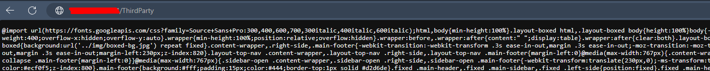

Title: Working around ASP.NET MVC's Bundler ignoring file orders
Published: 1/25/2024
Tags: [.NET, C#, ASP.NET MVC]
---

I recently ran into an issue on a project, where ASP.NET MVC's bundler was failing to minify CSS files, showing this error message when navigating to the bundle's virtual path:


A quick glance at the next few error messages imply that the bundler found an `@import` statement in the middle of the bundled CSS files. Some cursory research states that `@import` statements should appear before any other CSS statements ([source](https://www.thoughtco.com/difference-between-important-and-link-3466404)). So the initial fix I thought of was to reorder the files in the `BundleConfig`. The bundle initially looked like this:

```
bundles.Add(new StyleBundle("~/ThirdParty").Include(
    "~/ThirdParty/bootstrap/css/bootstrap.min.css",
    "~/Content/bootstrap-datetimepicker.css",
    "~/ThirdParty/jquery-jvectormap-1.2.2.css",
    "~/ThirdParty/AdminLTE.min.css",
    //...
));
```

I found that the `@import` statements were in the `AdminLTE.min.css` file, so I tried moving that to the top of the bundle includes:

```
bundles.Add(new StyleBundle("~/ThirdParty").Include(
    "~/ThirdParty/AdminLTE.min.css", // Bundle AdminLTE CSS first
    "~/ThirdParty/bootstrap/css/bootstrap.min.css",
    "~/Content/bootstrap-datetimepicker.css",
    "~/ThirdParty/jquery-jvectormap-1.2.2.css",
    //...
));
```

But the bundler ignored this ordering! For some reason, the minified file *always* included the `jquery-jvectormap` CSS, regardless how I passed in the files to the `Include()` call.

It turns out that [ASP.NET MVC tries to be smart about the *dependency order* of the files to be bundled](https://stackoverflow.com/a/19461440/2335880), and attempts to push certain files ahead of the generated bundle, based on certain library names. This is taken from the [source code](https://github.com/aspnet/AspNetWebOptimization/blob/master/src/System.Web.Optimization/BundleCollection.cs#L239) of the `System.Web.Optimization` package, which includes the bundlilng capabilities for ASP.NET MVC:

```
public static void AddDefaultFileOrderings(IList<BundleFileSetOrdering> list) {
    //...

    BundleFileSetOrdering css = new BundleFileSetOrdering("css");
    css.Files.Add("reset.css");
    css.Files.Add("normalize.css");
    list.Add(css);

    BundleFileSetOrdering jquery = new BundleFileSetOrdering("jquery");
    jquery.Files.Add("jquery.js");
    jquery.Files.Add("jquery-min.js");
    jquery.Files.Add("jquery-*");
    jquery.Files.Add("jquery-ui*");
    jquery.Files.Add("jquery.ui*");
    jquery.Files.Add("jquery.unobtrusive*");
    jquery.Files.Add("jquery.validate*");
    list.Add(jquery);

    BundleFileSetOrdering mod = new BundleFileSetOrdering("modernizr");
    mod.Files.Add("modernizr-*");
    list.Add(mod);

    BundleFileSetOrdering dojo = new BundleFileSetOrdering("dojo");
    dojo.Files.Add("dojo.*");
    list.Add(dojo);

    BundleFileSetOrdering moo = new BundleFileSetOrdering("moo");
    moo.Files.Add("mootools-core*");
    moo.Files.Add("mootools-*");
    list.Add(moo);

    BundleFileSetOrdering proto = new BundleFileSetOrdering("prototype");
    proto.Files.Add("prototype.js");
    proto.Files.Add("prototype-*");
    proto.Files.Add("scriptaculous-*");
    list.Add(proto);

    BundleFileSetOrdering ext = new BundleFileSetOrdering("ext");
    ext.Files.Add("ext.js");
    ext.Files.Add("ext-*");
    list.Add(ext);
}
```

It tries to prioritize the common [Reset CSS](https://meyerweb.com/eric/tools/css/reset/) files at the time, then includes [jQuery](https://jquery.com) first, then [Modernizr](https://github.com/Modernizr/Modernizr), [Dojo Toolkit](https://dojotoolkit.org/), [MooTools](https://mootools.net/), [PrototypeJS](http://prototypejs.org/), [Scriptaculous](http://script.aculo.us/), and finally [ExtJS](https://www.sencha.com/products/extjs/). (For the younger devs, these were the popular JS frameworks at the time ASP.NET MVC was also popular 😉)

So, how do we get around this default file ordering imposed by the built-in bundler? Unfortunately, it seems the `BundleCollection` class doesn't let you modify its ordering rules...

Turns out, we can override the bundle ordering for each `Bundle` we add to the `BundleCollection`. Each `Bundle` classes have an `Orderer` property that can be assigned to after creating one. However, `Orderer` is a property of type `IBundleOrderer`, which means to override the default ordering behaviour, we need to create our own orderer that implements this interface, then assign it as the `Bundle`'s orderer.

We can implement our custom `IBundleOrderer` like so:

```
/// <summary>
/// Use this orderer for bundles that need their files to be rendered as they are added
/// </summary>
public class ExplicitBundleOrderer : IBundleOrderer
{
	public IEnumerable<BundleFile> OrderFiles(BundleContext context, IEnumerable<BundleFile> files)
	{
		return files;
	}
}
```

Then assign it to `Bundle`s that we want explicit ordering for:
```
// create a new StyleBundle separately
var thirdPartyCss = new StyleBundle("~/ThirdParty")
{
	Orderer = new ExplicitBundleOrderer() // our custom IBundleOrderer
};

// include the needed files
thirdPartyCss.Include(
    "~/ThirdParty/AdminLTE.min.css", // Bundle AdminLTE CSS first
    "~/ThirdParty/bootstrap/css/bootstrap.min.css",
    "~/Content/bootstrap-datetimepicker.css",
    "~/ThirdParty/jquery-jvectormap-1.2.2.css",
    //...
);

// add to our BundleCollection
bundles.Add(thirdPartyCss);
```

After rebuilding, our bundler is now happy with no more complaints! 🎉

