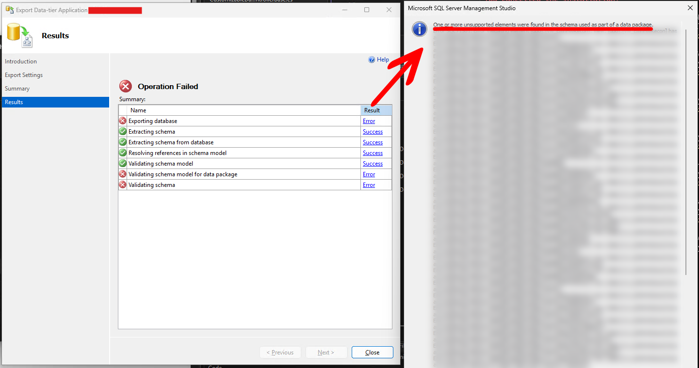
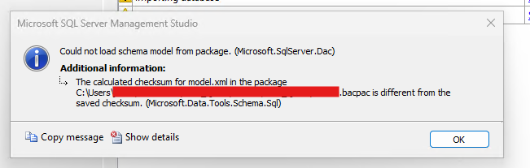
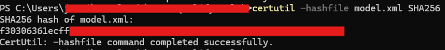

Title: Exporting and Importing SQL Server Data-Tier Application That Has Errors
Published: 9/1/2026
Tags: [SQL Server]
Image: posts/postimg/export-and-import-bacpac-with-errors.jpg
---

Are you trying to export an Azure SQL database, but it has problematic objects (such as views) that prevent you from generating a BACPAC file?

If you try to export a data-tier application via SQL Server Management Studio (SSMS), it will let you exclude tables and schemas, but not views, stored procedures or functions. This can be a blocker if views or SPs have errors. And sometimes, simply `DROP`ping the problematic objects is not an option.



If this is your situation, read further to learn how to work around this issue, and be able to backup and restore your Azure SQL database with the following steps:

### 1. Use `sqlpackage.exe` to export the BACPAC file and bypass schema validation

Microsoft provides a CLI tool called [sqlpackage](https://learn.microsoft.com/en-us/sql/tools/sqlpackage/sqlpackage-export?view=sql-server-ver17) to perform data-tier application operations, such as extract, export, import and deploy, via the command line. While this functionality is available with a GUI via SSMS, `sqlpackage` allows us to use options that are otherwise unavailable via the GUI.

For this exercise, we will disable the `VerifyExtraction` flag to bypass schema validation and allow us to generate a BACPAC file even if there are problems with the database schema.

If you do not have `sqlpackage` installed, you may do so via _winget_:

```powershell
winget install sqlpackage
```

Once done, export the BACPAC via `sqlpackage`:

```powershell
sqlpackage /Action:Export /TargetFile:"<local file path>" /SourceConnectionString:"<SQL Server connection string>" /p:VerifyExtraction=False
```

### 2. Modify the BACPAC model to exclude the problematic object(s)

While the previous step has allowed us to create a BACPAC file, the generated backup still contains the object(s) that caused errors from the GUI (which was bypassed in step 1).

The BACPAC file is effectively just a ZIP archive, so you can extract it locally, then inspect and modify its contents.

If you need to exclude view(s) from the BACPAC, open the `model.xml` file inside the archive. Locate the view definition's `<Element>` element, which looks like:

```xml
<Element Type="SqlView" Name="[dbo].[view-to-be-deleted]">
    <!-- ... -->
</Element>
```

Delete the view(s) you want to exclude from this XML file and save it.

### 3. Re-calculate the BACPAC's checksum

Modifying the contents of BACPAC file will cause the checksum generated at the time of exporting to be invalid. SQL Server will complain if you attempt to import a modified BACPAC with an error like this:



The checksum is defined in the BACPAC's `Origin.xml` file, which has a `<Checksum>` element for each file to be validated. BACPAC files are checksummed using **SHA256**.

On Windows, there is a built-in utility called `certutil` which can be used to calculate checksums for files, so we can run the following:

```powershell
certutil -hashfile model.xml SHA256
```

Which will give an output like so:



Replace the `<Checksum>` element for `model.xml` with the new value, then save `Origin.xml`.

Once done, re-compress all the files into a new ZIP archive, and rename the resulting file's extension back to `*.bacpac`.

### 4. Import the new BACPAC file

The new BACPAC file can then be imported via SSMS, or the same `sqlpackage` utility if preferred. This will now allow you to proceed importing the data-tier application, excluding any problematic objects that were removed in the previous steps.
