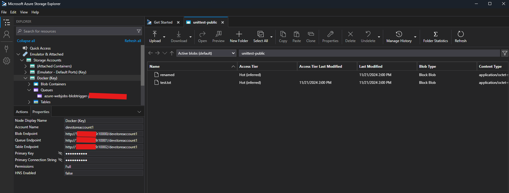
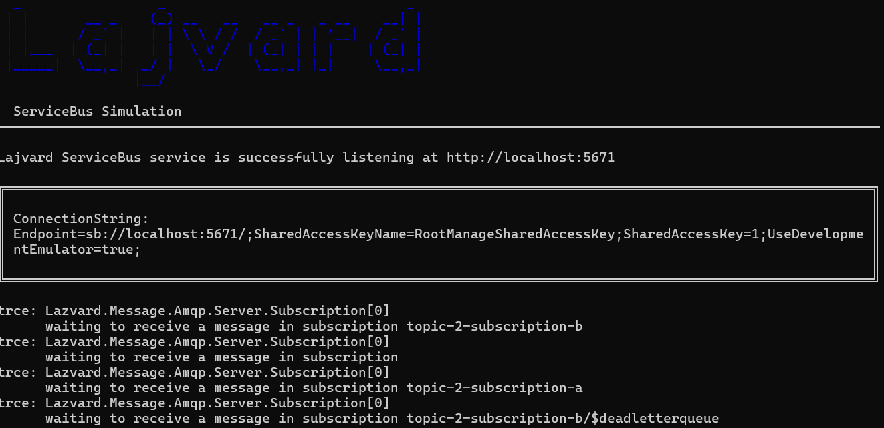
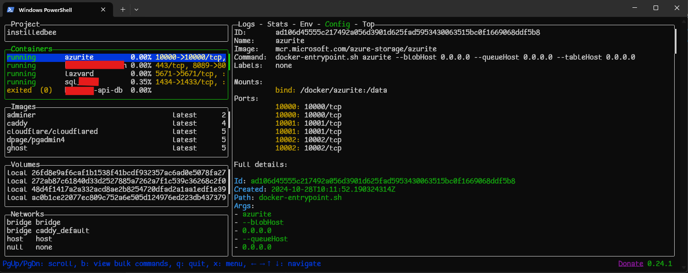

Title: Self-Hosting Azure Resources for Local Development
Published: 3/5/2025
Tags: [.NET, Docker, Azure, Self-hosting, DevOps]
Description: How to improve the local development experience when targetting Azure services
Image: posts/postimg/local-development-with-azure-resources.jpg
---

I have recently been getting involved into cloud app projects that require connecting into Azure resources. While it is
very interesting to learn about Azure resources at work, there are also certain challenges during local development, such as:

* Requiring internet connectivity even during isolated local development, which can be a hassle when working remotely and online access isn't possible 24/7.
* Development/testing resources can be spun up, but some Azure resources have no free tier, making setting up a dev/test environment incur additional cost for the team.
* Sharing a dev/test resource with other team members can cut down costs, but increase the risk of breaking changes for others, which adds friction to the development experience.

There are ways around this, at the code level for example, abstracting away references to concrete dependencies to the cloud resources,
and generating mocks that are injected when debugging locally. This may work to an extent, but what if you need to test behaviour that
needs to replicate the Azure resource as accurately as possible?

Thankfully, there exist quite a bit of self-hosting options, which aim to replicate the same behaviour and experience as targetting these cloud resources directly. I'm sharing a few that I have used personally while working on cloud-native projects:

## Azure Blob Storage → Azurite

Azurite is Microsoft's official emulator for Azure Blob Storage. As an official package, it is guaranteed to work as a seamless drop-in to a remote blob storage server, and is closely compatible with all of the available storage APIs.

Azurite is [open-source](https://github.com/Azure/Azurite), and is built with Node.js. It is possible to run Azurite directly from source, via the official [VS Code Extension](https://marketplace.visualstudio.com/items?itemName=Azurite.azurite), or via [Docker](https://hub.docker.com/_/microsoft-azure-storage-azurite).

Once set up (on your local machine for example), you can use the [provided connection strings](https://github.com/Azure/Azurite?tab=readme-ov-file#connection-strings) to connect to the Blob Service, Queue Service and Table Service as you would normally with a remote Azure Blob Storage resource. You can do this e.g. with [Azure Storage Explorer](https://azure.microsoft.com/en-us/products/storage/storage-explorer/):

## Azure Service Bus → Lazvard

Azure Service Bus doesn't have an official emulator available at the time of writing. However, there are open-source alternatives built by members of the community. This is possible thanks to Azure Service Bus being an AMQP-compliant service, and effectively anyone can build drop-in replacements, so long as those are AMQP-compatible, and Service Bus API-compatible as well.

One such example is [Lazvard](https://github.com/PejmanNik/lazvard-message), which is a lightweight, self-hostable API-compatible alternative to Azure Service Bus.

Lazvard is written in C# and targets .NET 8, making it cross-compatible to run on most machines that supports the latest .NET runtime Lazvard can be run directly as a CLI application running on a host machine with .NET installed, or as a [Docker container](https://hub.docker.com/r/pejmann/lazvard-message). It is highly configurable, and allows for any number of queues, topics and subscriptions.

Once you are set up, the Lazvard console will show a live update log of all requests and messages that come through.

## Azure SQL Server → SQL Server on Docker

Azure SQL Server can be easily substituted during local development by installing either SQL Server Express or Developer Edition, but this can only be installed primarily on Windows machines, and can be cumbersome and/or resource intensive when installed directly on a host machine that is also used for programming.

Thankfully, Microsoft has provided an [official Docker image](https://hub.docker.com/r/microsoft/mssql-server) of SQL Server, which can be set up on any machine that supports running Docker containers, including Linux and Mac OS. This opens up more possibilities for developers who aren't running (or targetting) Windows environments.

The Docker version of SQL Server behaves mostly the same as a bare metal installation. There are a few gotchas around using features, like using Windows Authentication, or restoring from backups (`*.bak` files), which require copying files *into* the container's filesystem. But there are several resources (more on this blog too, soon!) working around the quirks of a Dockerized SQL Server instance.

## My setup

Personally, I host the above services via Docker containers, which I then self-host on my home server, and connect to their addresses from my laptop. This allows me to isolate these development dependencies cleanly from my daily driver PC, and I find it safer to just recreate containers when I am done with the project using them, or if I run into any configuration issues. I persist data on mounted volumes whenever appropriate, as is the case for Azure Storage and SQL Server, so I can back up the container data and restore as needed.

It's been a boost to my productivity as a developer, where instead of worrying if my machine will have any problems if I uninstall SQL Server or some other dependency, I can quickly start from scratch.

Do you know of other cloud services that can be replaced with local, self-hosted versions for development? Drop them in the comments below! 🙂